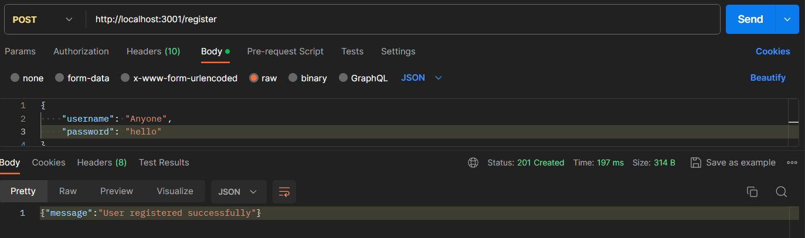
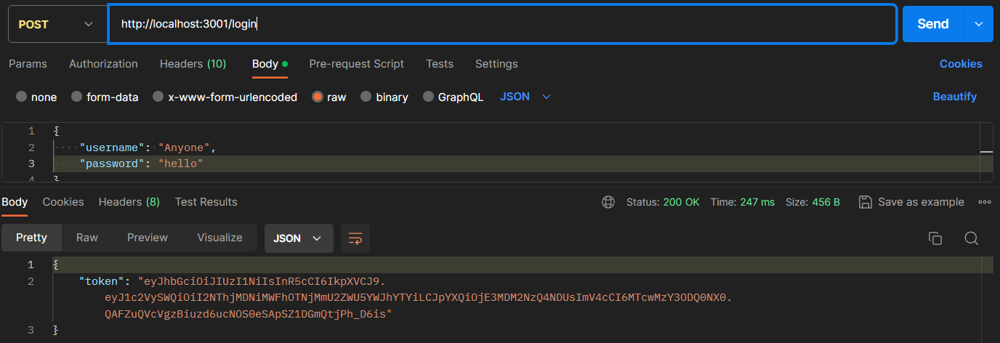
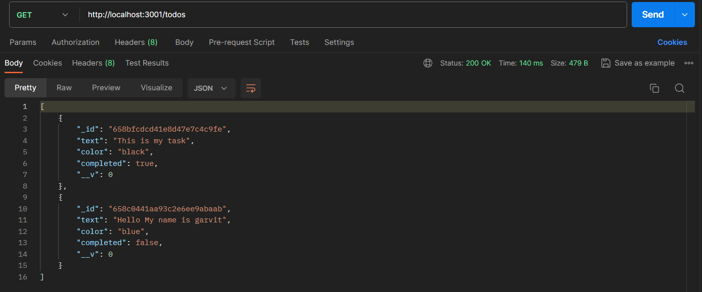
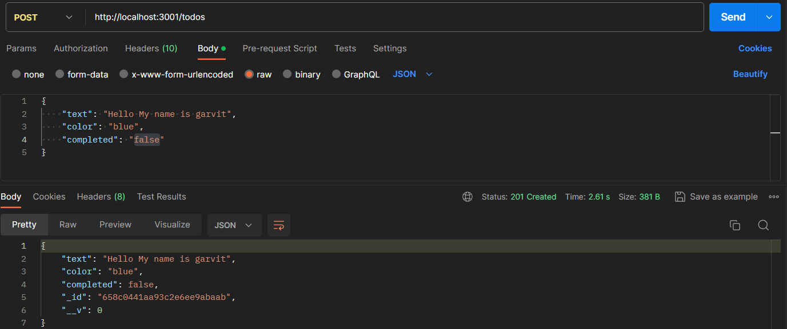
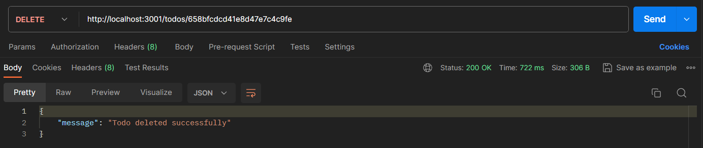

# TODO App Backend

This is the backend server for a TODO app. It provides API endpoints for managing TODOs and user authentication.

## Getting Started

1. **Clone the repository:**

   ```bash
   git clone https://github.com/your-username/todo-backend.git
   cd todo-backend
   ```

2. **Install dependencies:**

   ```bash
   npm install
   ```

3. **Start the server:**

   ```bash
   node app.js
   ```

   The server will be running at [http://localhost:3001](http://localhost:3001).

## API Endpoints

### User Authentication

#### Register a User

- **Endpoint:** `POST /register`
- **Description:** Register a new user.
- **Request Body:**
  ```json
  {
    "username": "your_username",
    "password": "your_password"
  }
  ```

  

#### Login

- **Endpoint:** `POST /login`
- **Description:** Authenticate and receive a JWT token.
- **Request Body:**
  ```json
  {
    "username": "your_username",
    "password": "your_password"
  }
  ```
- **Response:**
  ```json
  {
    "token": "your_jwt_token"
  }
  ```

  

### TODO Management

#### Get Todos

- **Endpoint:** `GET /todos`
- **Description:** Get all TODOs.
- **Authorization Header:**
  ```
  Authorization: Bearer your_jwt_token
  ```

  

#### Add Todo

- **Endpoint:** `POST /todos`
- **Description:** Add a new TODO.
- **Authorization Header:**
  ```
  Authorization: Bearer your_jwt_token
  ```
- **Request Body:**
  ```json
  {
    "text": "Your todo text",
    "color": "#ffffff",
    "completed": false
  }
  ```

  

#### Update Todo

- **Endpoint:** `PUT /todos/:id`
- **Description:** Update an existing TODO.
- **Authorization Header:**
  ```
  Authorization: Bearer your_jwt_token
  ```
- **Request Body:**
  ```json
  {
    "text": "Updated todo text",
    "color": "#ffffff",
    "completed": true
  }
  ```

#### Delete Todo

- **Endpoint:** `DELETE /todos/:id`
- **Description:** Delete a TODO.
- **Authorization Header:**
  ```
  Authorization: Bearer your_jwt_token
  ```


## Technologies Used

- Node.js
- Express.js
- MongoDB
- JSON Web Token (JWT)
- Bcrypt
- ...

## Contributors

- [Garvit Agrawal](https://github.com/garvit74)

Feel free to contribute by opening issues or pull requests!
```

Copy and paste this content into your `README.md` file in your GitHub repository. Customize the content according to your project's details.
